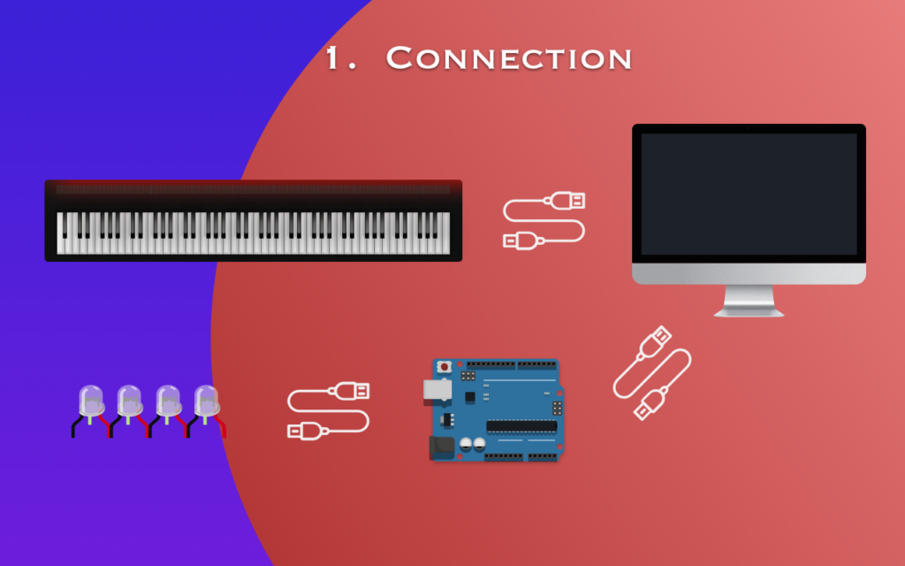

**Piano LED for Arduino (PLA)** is a *free, lightweight, without Ad*. application that allows you to controll LED-Strips during you playing digital piano (you still need an Arduino board, like UNO). It is able to receive MIDI message from your digital piano and transmit the MIDI data to Arduino, so that Arduino is able to control LEDs with the MIDI-Streaming. You can also play piano with this app and Logic Pro together.

**Demo**: [YouTube](https://youtu.be/SiLaIkchdn4)

For new informations please visit at: [this link](https://www.mahong.me/archives/831)

# Download Links
Version 1.0: [Google Drive](https://drive.google.com/file/d/1BcECvxdBHfR2Y0WgC1VY_5yRrhZZ0OAX/view?usp=sharing), [MEGA](https://mega.nz/file/LHBDnIKa#Pr-MxP1Z7d9Q6Bov0dXnC5QXqigoT0Y1XQUhZjIgNy4).

> Do NOT stare at the LED for a long time, it will permanently damage your eyes!

# Working Principle (Data Flow)

# Requirement
1. Arduino Uno
2. Two meter LED Strip (144/meter, model WS2812B)
3. 330 ohm resistor (optional)
4. Three Jumper wires (other similar wires are also OK)
5. Two USB cables (type B), used to connect Arduino and MIDI-Device to your Mac
6. A Mac with operating system Big Sur(MacOS 11.0) or above
7. Digital Piano or a MIDI-Keyboard

# Preparation
[Video](https://youtu.be/4Wy7yPoIVsI)

1. Turn on the piano’s MIDI transmission function
2. connecting your digital computer to your Mac
3. Following the next figure, correctly connect the WS2812B light strip (in this case with Arduino Uno). Normally, the red port of the light strip need the 5V power as input, the white wire is ground (GND), and the green cable needs to connect to **port 9**. For details please refer to the description of the light strip for the specific connection method.

4.  Install [Arduino IDE for Mac](https://www.arduino.cc/en/software) and save Arduino Stekch. An simple Arduino sketch sample is also included in this application. You can easily save this sketch by clicking `File` -> `Save Arduino Sketch to Disk`

5. Add `FastLED library` to your Arduino bibliothek
6. Upload Arduino Sketch to Uno
7. Turn on your piano and connect Arduino Uno to your Mac
> You must turn on your piano before you start this app, otherwise the PLA will not connect to your piano
8. Start your App, and enjoy.

# Quick Start
> Arduino only needs to be set up once! In the future if you play with Piano LED for Arduino, you only need to use a USB cable to connect Arduino to your Mac

1. Connect Arduino (Assum you have already uploaded the sketch to Arduino) and your digital piano via USB cable to your Mac and then turn on your digital piano
2. Select the Arduino port by click left or right arrow, default port name is usbmodem14201 (it may different)
3. Press Power button at right top corner to connect to Arduino. 
4. When you see the the LED indicator start blinking from A0 to C6, you are able to play with that. Enjoy yourself 😄

PS: The test environment is with Arduino Uno, MacBook Pro 16 (2019), Roland FP-90. It is not guaranteed to be compatible with other test environments. If you encounter any LED lights flickering during the performance, you can try to restart the software or disconnect the device to try again. If you still have problems, please write and submit a bug.

# About transmission message
The message which generated from PLA is only one byte, it contains **note on/off status** and **note number**. note status is at first bit and the last seven bits are note number.
## Note Status
If the first bit is one, that means the piano key note is pressed (note on status), which in decimal will be added by **128**
##Note Number
There are totally 88 key notes on piano, therefor the range of this transmission message is [21~108] = [0x15~0x6c] = 0b[0001 0101 ~ 0110 1100].
## Example
If key note A0 (the first key of your piano) is release, PLA will send 21(0x15) to Arduino, when this key is pressed, PLA will send 149(21+128) to Arduino.

If key note C8 (the last key of your piano) is release, PLA will send 108(0x6C) to Arduino, when this key is pressed, PLA will send 236(108+128) to Arduino.

